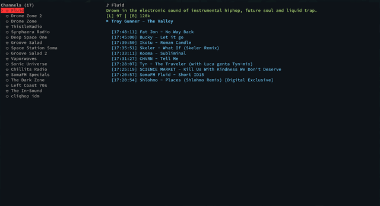
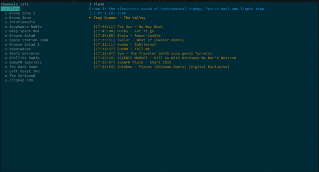
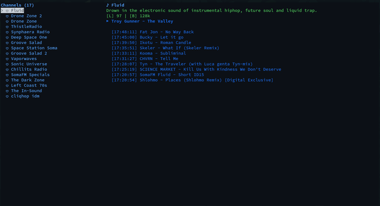
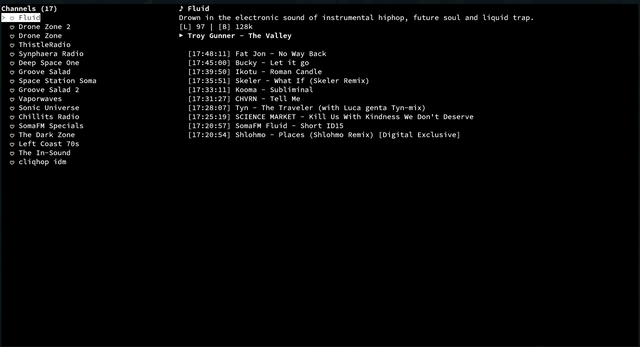
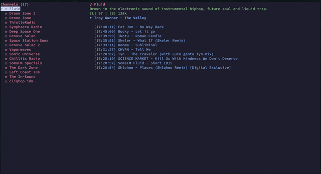
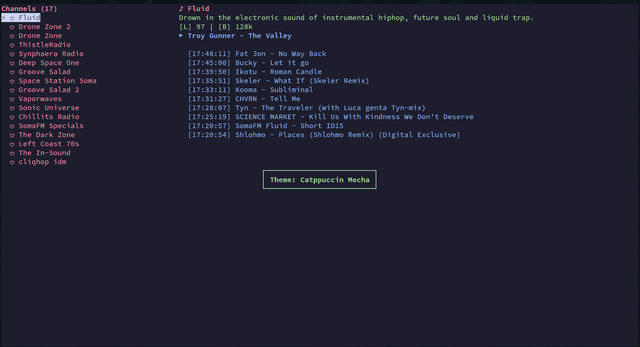
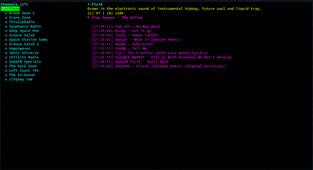
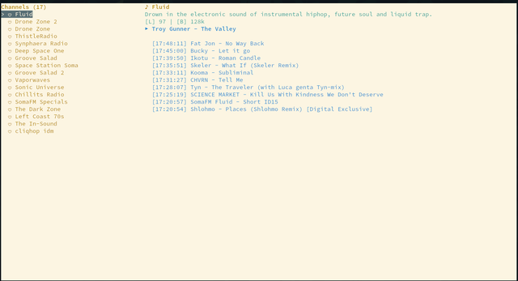
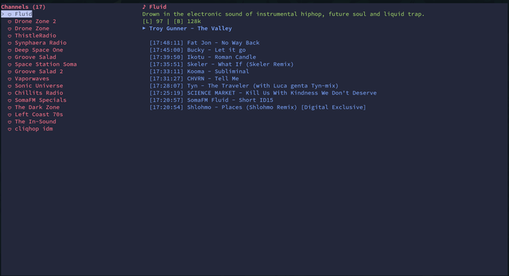
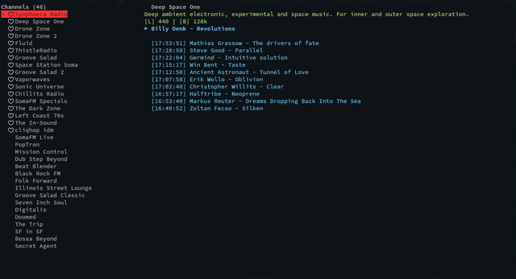

# SomaFM TUI Player

[](https://aur.archlinux.org/packages/somafm_tui)
[](https://opensource.org/licenses/MIT)
[](https://www.python.org/downloads/)

**SomaFM TUI Player** is a modern terminal application for listening to [SomaFM](https://somafm.com/) — the legendary internet radio with over 40 unique channels.

The app combines a minimalist interface, rich features, and low resource consumption, making it ideal for terminal-based workflows.

---

## 🌟 Features

### Core Features

- **📻 40+ Radio Channels** — Access all SomaFM channels directly from your terminal
- **🎵 Track Metadata** — Real-time display of artist and track title, plus a rolling history of recently played tracks (up to 10) that persists across channel switches and stop/start, with channel attribution per entry
- **❤️ Favorites** — Save favorite channels and individual tracks with local persistence
- **🎨 Color Themes** — 20+ built-in themes (dark and light); edit `themes.json` and switch with `t`/`y` without restarting
- **🔊 Volume Control** — Adjust volume with keyboard shortcuts and a temporary on-screen bar
- **⏱ Sleep Timer** — Auto-shutdown with configurable timer (1–480 minutes)
- **🔍 Search** — Quick channel search by name and description (volume keys work while searching)
- **📊 Usage-Based Sorting** — Channels sorted by listening history
- **🔍 Favorites-Only Mode** — Filter channel list to show only favorites (`z`)
- **💚 Add Track to Favorites** — Save the currently playing track with `f` (add-only)
- **🙈 Toggle Hotkey Hints** — Hide/show the bottom footer with keybindings (`x`)
- **👥 Listener Count** — Display number of listeners per channel
- **🎚 Bitrate Selection** — Choose stream quality per channel
- **📋 Channel Details** — Description, listeners, and bitrate shown in the playback panel
- **💬 Toast Notifications** — Brief on-screen messages for theme changes, favorites, and settings
- **📐 Terminal Resize** — Layout redraws automatically when the terminal window is resized

### System Integration

- **🎧 MPRIS/D-Bus** — Linux media keys, volume control, metadata, and channel artwork in desktop media applets
- **⌨️ Vim Navigation** — `j/k` key navigation for Vim users
- **📦 AUR Package** — Easy installation on Arch Linux via AUR
- **✅ Dependency Check** — Helpful startup messages if MPV or Python packages are missing

---

## 📦 Installation

### Arch Linux (Recommended)

Install from **AUR** (Arch User Repository):

```bash
paru -S somafm_tui
# or
yay -S somafm_tui
```

Manual installation from AUR:

```bash
git clone https://aur.archlinux.org/somafm_tui.git
cd somafm_tui
makepkg -si
```

After installation, run the app with:
```bash
somafm-tui
```

### Installation from Source

```bash
# Clone the repository
git clone https://github.com/zsh-ncursed/somafm_tui.git
cd somafm_tui

# Create virtual environment (recommended)
python -m venv venv
source venv/bin/activate

# Install dependencies
pip install -r requirements.txt

# Run the application
python -m somafm_tui
```

### Installation via pip

Install directly from PyPI (when available):

```bash
pip install somafm-tui
```

Or install from the repository:

```bash
pip install git+https://github.com/zsh-ncursed/somafm_tui.git
```

After pip installation, the `somafm-tui` command will be available in your PATH.

### Installation via pipx

[pipx](https://pipx.pypa.io/) installs Python CLI applications in isolated environments. Recommended way to install `somafm-tui` without affecting system packages:

```bash
# Install pipx (if not already installed)
pip install pipx
# or on Arch Linux: sudo pacman -S python-pipx

# Install somafm-tui
pipx install somafm-tui
```

After installation, run with:
```bash
somafm-tui
```

To update:
```bash
pipx upgrade somafm-tui
```

> **Note:** `mpv` must still be installed on your system via your package manager (see [Dependencies](#dependencies)).

### Shell Scripts

Quick launch using provided scripts:

```bash
# Fish shell
./somafm.fish

# Bash/Zsh
./somafm.sh
# or
./somafm.bash
```

### Dependencies

- **Python 3.8+**
- **MPV** — Media player for stream playback
- **python-requests** — HTTP client for API requests
- **python-mpv** — MPV Python bindings
- **python-dbus-next** — D-Bus integration for MPRIS (optional)

#### Installing Dependencies on Different Distributions

**Arch Linux:**
```bash
sudo pacman -S python mpv python-requests python-mpv python-dbus-next
```

**Ubuntu/Debian:**
```bash
sudo apt-get install python3 python3-pip mpv libmpv-dev
pip install requests mpv dbus-next
```

**Fedora:**
```bash
sudo dnf install python3 python3-pip mpv mpv-libs
pip install requests mpv dbus-next
```

---

## ⌨️ Controls

### Interactive Mode

Launch the application:
```bash
somafm-tui
```

Press `?` in the app for the full in-app help overlay (includes version number).

### Navigation

| Key | Action |
|-----|--------|
| `↑` / `↓` or `j` / `k` | Navigate channel list |
| `Enter` or `l` | Play selected channel |
| `/` | Search channels |
| `?` | Toggle help window |
| `Esc` | Exit search / close help / cancel sleep timer input |
| `f` | Add current track to favorites |
| `Ctrl+F` | Toggle channel favorite (heart icon) |
| `t` / `y` | Cycle color themes forward/backward |
| `z` | Toggle favorites-only filter (persisted in config) |
| `x` | Toggle footer with keybinding hints (persisted in config) |
| `q` | Quit application |

### Playback

| Key | Action |
|-----|--------|
| `Space` | Toggle play/pause |
| `h` | Stop playback |
| `r` | Cycle bitrate (if available) |
| `s` | Set sleep timer |
| `PgUp` / `b` | Increase volume (shows temporary volume bar) |
| `PgDn` / `v` | Decrease volume (shows temporary volume bar) |
| `f` | Add current track to favorites (requires track metadata) |
| `Ctrl+F` | Toggle channel favorite (heart icon) |

### Appearance

| Key | Action |
|-----|--------|
| `t` | Cycle color theme forward |
| `y` | Cycle color theme backward |

### Command-Line Interface

The application supports various CLI arguments for automation and quick actions:

```bash
# Show help
somafm-tui --help

# List all available channels (short: -l)
somafm-tui --list-channels

# Search for channels (short: -s)
somafm-tui --search "drone"

# Show favorite channels (short: -f)
somafm-tui --favorites

# List available themes
somafm-tui --list-themes

# Play channel by ID or title, with custom settings
somafm-tui --play dronezone --volume 70 --theme dracula
somafm-tui -p "Drone Zone" -v 50 -t monochrome

# Set sleep timer from command line (minutes)
somafm-tui --sleep 60

# Disable MPRIS integration
somafm-tui --no-dbus

# Combine multiple options
somafm-tui -p groovesalad -v 50 -t monochrome --sleep 30
```

| Option | Short | Description |
|--------|-------|-------------|
| `--play` | `-p` | Channel ID or title to play on launch |
| `--volume` | `-v` | Volume level (0–100) |
| `--theme` | `-t` | Color theme name |
| `--list-channels` | `-l` | List channels and exit |
| `--search` | `-s` | Search channels and exit |
| `--favorites` | `-f` | List favorite channels and exit |
| `--sleep` | | Sleep timer in minutes (1–480) |
| `--no-dbus` | | Disable MPRIS/D-Bus |
| `--list-themes` | | List themes and exit |
| `--version` | | Print version and exit |

### MPRIS (Media Keys)

When D-Bus support is enabled (`dbus_allowed: true` in config), the app registers as `org.mpris.MediaPlayer2.somafm_tui` and responds to:

- **Play/Pause** — Toggle playback (or start the selected channel if stopped)
- **Next** — Next channel in the list
- **Previous** — Previous channel in the list
- **Stop** — Stop playback
- **Volume** — Set volume via D-Bus property (0.0–1.0)
- **Quit** — Exit the application

With `dbus_send_metadata = true`, track title and artist are sent to media applets. Enable `dbus_send_metadata_artworks` and `dbus_cache_metadata_artworks` to show channel artwork (cached under `/tmp/.somafmtmp/cache/artworks/`).

---

## ⚙️ Configuration

### Config File

Configuration is stored at `~/.config/somafm_tui/somafm.cfg` (XDG Base Directory). On first launch, files from the legacy path `~/.somafm_tui/` are migrated automatically if present.

```ini
# Configuration file for SomaFM TUI Player
#
# theme: Color theme
# dbus_allowed: Enable MPRIS/D-Bus support for media keys (true/false)
# dbus_send_metadata: Send channel metadata over D-Bus (true/false)
# dbus_send_metadata_artworks: Send channel picture with metadata over D-Bus (true/false)
# dbus_cache_metadata_artworks: Cache channel picture locally for D-Bus (true/false)
# volume: Default volume (0-100)
# show_only_favorites: Show only favorite channels (true/false)
# show_footer: Show footer instructions (true/false)
#
[somafm]
theme = default
dbus_allowed = false
dbus_send_metadata = false
dbus_send_metadata_artworks = false
dbus_cache_metadata_artworks = true
volume = 100
show_only_favorites = false
show_footer = true
```

### Configuration Examples

**Basic setup with custom volume:**
```ini
[somafm]
theme = dracula
volume = 80
dbus_allowed = false
```

**Full MPRIS integration (Linux desktop):**
```ini
[somafm]
theme = github-dark
dbus_allowed = true
dbus_send_metadata = true
dbus_send_metadata_artworks = true
dbus_cache_metadata_artworks = true
volume = 70
```

**Minimal configuration (no D-Bus, default theme):**
```ini
[somafm]
theme = default
dbus_allowed = false
volume = 100
```

### Available Themes

Run `somafm-tui --list-themes` to see all available themes:

#### Dark Themes

| Theme | Description |
|-------|-------------|
| `default` | Default Dark — Classic dark theme with high contrast |
| `dracula` | Dracula — Popular dark theme with pink and cyan accents |
| `github-dark` | GitHub Dark — GitHub's official dark theme |
| `gruvbox` | Gruvbox Dark — Retro terminal theme with warm colors |
| `monokai` | Monokai Pro — Vibrant theme with pastel colors |
| `nord` | Nord — Arctic blue theme with cool tones |
| `one-dark` | One Dark — Atom's default dark theme |
| `solarized-dark` | Solarized Dark — Balanced contrast with cyan/blue |
| `tokyo-night` | Tokyo Night Storm — Deep blue/purple theme |
| `ayu-dark` | Ayu Dark — Minimal dark theme with bright accents |
| `ayu-mirage` | Ayu Mirage — Dark theme with warm sunset colors |
| `night-owl` | Night Owl — Dark theme optimized for late night coding |
| `catppuccin` | Catppuccin Mocha — Pastel dark theme |
| `cobalt` | Cobalt — Classic blue dark theme |
| `zenburn` | Zenburn — Low contrast dark theme |
| `everforest` | Everforest Dark — Nature-inspired dark theme |
| `kanagawa` | Kanagawa Dragon — Japanese-inspired dark theme |
| `snazzy` | Snazzy — Hyper terminal's popular theme |
| `monochrome-dark` | Monochrome — Pure black and white theme |

#### Light Themes

| Theme | Description |
|-------|-------------|
| `one-light` | One Light — Atom's light theme |
| `github-light` | GitHub Light — GitHub's official light theme |
| `solarized-light` | Solarized Light — Balanced contrast light theme |
| `ayu-light` | Ayu Light — Clean light theme with orange accents |
| `material-light` | Material Light — Google Material Design light theme |

See `somafm_tui/themes.json` for complete color definitions. Themes are reloaded from this file when you switch themes with `t` or `y` — no restart required.

### Enabling MPRIS

For Linux media keys integration, set:

```ini
dbus_allowed = true
dbus_send_metadata = true
```

The app will then appear in media control systems (GNOME, KDE, etc.)

---

## 📁 Data Structure

### Directories

| Path | Purpose |
|------|---------|
| `~/.config/somafm_tui/somafm.cfg` | Configuration file |
| `~/.config/somafm_tui/channel_favorites.json` | Favorite channels |
| `~/.config/somafm_tui/channel_usage.json` | Channel listening history (for sorting) |
| `~/.config/somafm_tui/track_favorites.json` | Favorite tracks |
| `/tmp/.somafmtmp/somafm.log` | Application log (DEBUG level) |
| `/tmp/.somafmtmp/cache/channels.json` | SomaFM API channel cache (1 hour TTL) |
| `/tmp/.somafmtmp/cache/artworks/` | Cached channel artwork for MPRIS |

> **Legacy path:** `~/.somafm_tui/` — migrated to `~/.config/somafm_tui/` on first run.

### Data Formats

**Favorites** (`channel_favorites.json`):
```json
["dronezone", "beatblender", "groovesalad"]
```

**Channel usage** (`channel_usage.json`) — Unix timestamps for usage-based sorting:
```json
{
  "dronezone": 1709481600,
  "beatblender": 1709395200
}
```

**Track favorites** (`track_favorites.json`):
```json
[
  {
    "artist": "Artist Name",
    "title": "Track Title",
    "channel_id": "dronezone",
    "channel_name": "Drone Zone",
    "added_at": "2026-05-03 12:34:56"
  }
]
```

---

## 🔧 Troubleshooting

### Error: "MPV player is not installed"

Ensure MPV is installed on your system:

```bash
# Check installation
mpv --version

# Install (Arch Linux)
sudo pacman -S mpv

# Install (Ubuntu/Debian)
sudo apt-get install mpv

# Install (Fedora)
sudo dnf install mpv
```

### Error: "Failed to fetch channels"

Check your internet connection and SomaFM API availability:

```bash
# Test API connectivity
curl https://api.somafm.com/channels.json

# Check DNS resolution
ping api.somafm.com

# If using a firewall, ensure outbound HTTPS (port 443) is allowed
```

**Solutions:**
1. Check your internet connection
2. Verify SomaFM API is accessible: `curl -I https://api.somafm.com/channels.json`
3. If behind a proxy, set environment variables:
   ```bash
   export HTTP_PROXY=http://proxy:port
   export HTTPS_PROXY=https://proxy:port
   ```
4. Clear channel cache and retry:
   ```bash
   rm -rf /tmp/.somafmtmp/cache/channels.json
   somafm-tui
   ```

### Error: "No channel playing" or playback issues

1. **Check stream URL availability:**
   ```bash
   # Test stream connectivity
   mpv --really-verbose "https://ice1.somafm.com/dronezone-128-mp3"
   ```

2. **Reset configuration:**
   ```bash
   rm ~/.config/somafm_tui/somafm.cfg
   somafm-tui
   ```

3. **Check audio output:**
   - Ensure system volume is not muted
   - Verify audio device is selected correctly in MPV

### Unicode Symbols Display Incorrectly

Listener count and bitrate use ASCII labels (`[L]`, `[B]`). Other UI symbols (play/pause, favorites, volume) use Unicode. If characters render as boxes or question marks, use a Unicode-capable terminal and font:

```bash
export TERM=xterm-256color
```

Add to your shell configuration (`~/.bashrc` or `~/.zshrc`):
```bash
export TERM=xterm-256color
```

### MPRIS Not Working

1. Ensure `dbus_allowed = true` in config
2. Verify `python-dbus-next` is installed:
   ```bash
   pip show dbus-next
   ```
3. Check D-Bus service is running:
   ```bash
   systemctl --user status dbus
   ```
4. Verify app appears in media controllers:
   ```bash
   playerctl --list-all
   ```
5. Restart the application after configuration changes

### Sleep Timer Not Working

1. Maximum sleep timer is 480 minutes (8 hours)
2. Check if timer is active: look for `⏱ MM:SS` in bottom right corner
3. Cancel and re-set timer if needed:
   - Press `s` to open sleep overlay
   - Enter minutes (1-480)
   - Press Enter to confirm

### High CPU Usage

1. Disable MPRIS if not needed:
   ```ini
   dbus_allowed = false
   ```

2. Reduce cache update frequency (if applicable)

3. Check for background processes:
   ```bash
   ps aux | grep somafm
   ```

### Logs and Debugging

The app writes DEBUG-level logs to `/tmp/.somafmtmp/somafm.log` automatically:

```bash
# Real-time log viewing
tail -f /tmp/.somafmtmp/somafm.log

# Last 50 lines
tail -n 50 /tmp/.somafmtmp/somafm.log
```

**Common log messages:**
- `Using cached channels` — Channel cache is working (refreshed hourly; stale cache used if API is unreachable)
- `Timeout fetching` — Network issues, retrying automatically
- `MPRIS service disabled` — D-Bus integration is off (expected if `dbus_allowed = false`)
- `Migrated ... from ~/.somafm_tui` — Legacy config was moved to XDG path

---

## 📊 Screenshots

The TUI supports a wide range of themes. Here are a few highlights.

### Themes

| | |
|:---:|:---:|
| **Ayu Dark** | **Solarized Dark** |
|  |  |

| | |
|:---:|:---:|
| **GitHub Dark** | **Monochrome Dark** |
|  |  |

| | |
|:---:|:---:|
| **Catppuccin** | **Catppuccin (theme change toast)** |
|  |  |

| | |
|:---:|:---:|
| **Default Dark** | **Solarized Light** |
|  |  |

| |
|:---:|
| **Tokyo Night** |
|  |

### Browsing & Playback (Ayu Dark)

| | |
|:---:|:---:|
| **Ayu Dark** | **Ayu Dark** |
|  |  |

---

## 🤝 Contributing

We welcome contributions! Please read [CONTRIBUTING.md](CONTRIBUTING.md) before submitting pull requests.

### Reporting Bugs

- Check existing issues first
- Include app version (`somafm-tui --version` or from PKGBUILD)
- Attach logs from `/tmp/.somafmtmp/somafm.log`

### Feature Requests

- Describe the desired functionality
- Explain how it improves user experience

---

## 📄 License

Distributed under the **MIT License**. See [LICENSE](LICENSE) for details.

---

## 🙏 Acknowledgments

- **[SomaFM](https://somafm.com/)** — For amazing radio and open API
- **python-mpv** — For excellent MPV Python bindings
- **dbus-next** — For modern D-Bus library for Python

---

## 📬 Contact

- **GitHub**: [zsh-ncursed/somafm_tui](https://github.com/zsh-ncursed/somafm_tui)
- **AUR**: [somafm_tui](https://aur.archlinux.org/packages/somafm_tui)
- **Email**: zsh.ncursed@gmail.com

---

## 🗺 Roadmap

- [ ] Listening history export
- [ ] Last.fm integration (scrobbling)
- [ ] Support for other streaming services
- [ ] GUI settings via ncurses dialogs
- [ ] Mute toggle
- [ ] System tray integration

---

*Made with ❤️ for quality internet radio lovers*
